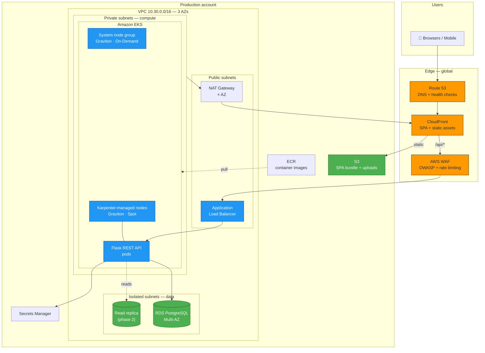
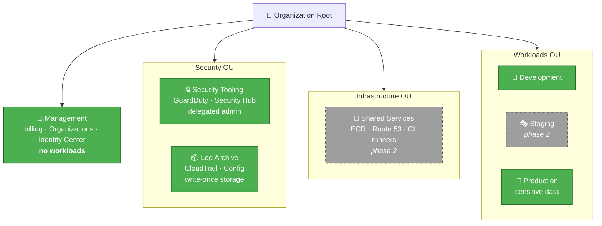
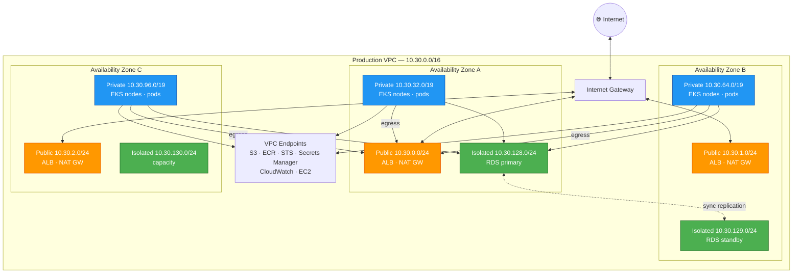
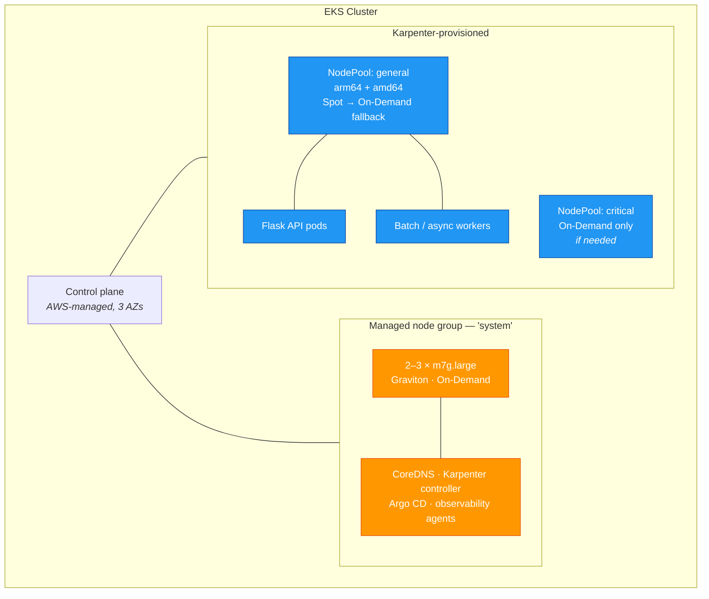
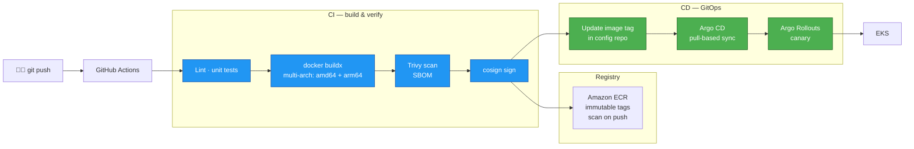
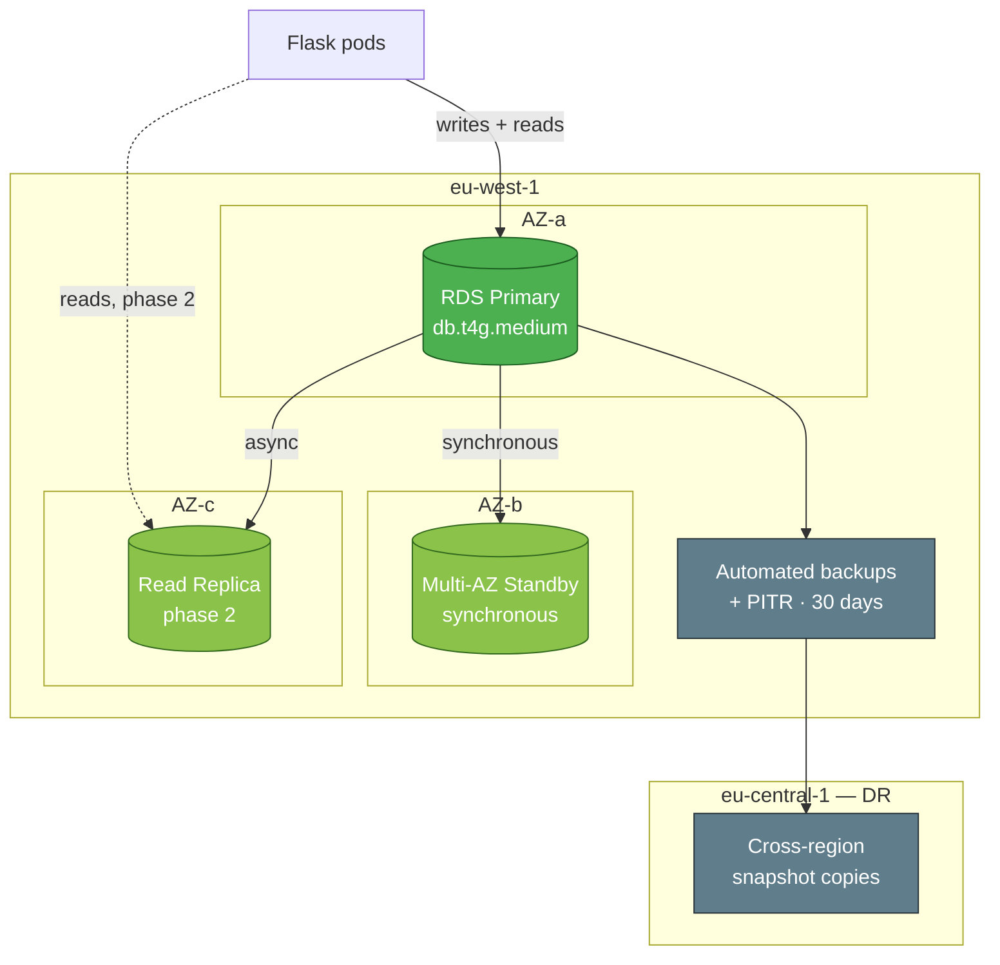

# Architecture Design — Innovate Inc.

**Cloud infrastructure design for a Flask + React + PostgreSQL application on AWS**

Author: Adianny Ramírez
Date: September 2026

---

## 1. Executive summary

Innovate Inc. needs an infrastructure that works for **hundreds of users today** and can grow to **millions** without a rewrite. Those are two different problems, and the most common way to fail this brief is to solve only the second one: a startup that deploys a multi-region, multi-cluster, service-meshed platform on day one burns its runway on infrastructure nobody is using yet.

The design below therefore optimises for a specific property: **every early decision is cheap now and does not have to be undone later.**

| Area | Decision | One-line rationale |
|---|---|---|
| Cloud | **AWS** | Deepest managed-Kubernetes and managed-Postgres ecosystem; the team wants managed K8s |
| Accounts | **AWS Organizations, 5 accounts at launch** (grow to 7) | Isolation of production is non-negotiable with sensitive data; more accounts than that is overhead they cannot yet operate |
| Network | **One VPC per environment, 3 AZs, three subnet tiers** | Database tier physically unable to reach the internet; non-overlapping CIDRs keep future connectivity options open |
| Compute | **Amazon EKS** — small managed node group for system components + **Karpenter** for workloads | Managed control plane; Karpenter gives fast, cost-optimal scaling without maintaining ASG maths |
| CPU | **Graviton (arm64) by default, Spot for stateless** | 20–40 % better price/performance; Python and Node build cleanly for arm64 |
| Database | **RDS for PostgreSQL Multi-AZ now → Aurora when growth justifies it** | Aurora's floor cost is not worth paying for hundreds of users a day; migration path is well-trodden |
| Delivery | **GitHub Actions (build) + Argo CD (deploy)** | Pull-based GitOps means the cluster is never exposed to CI credentials |

**Estimated steady-state cost at launch: ~$450–700/month**, dominated by EKS control plane, NAT and RDS. Section 8 breaks this down and lists the levers.

---

## 2. Design principles

These are the rules used to arbitrate every decision below.

1. **Start simple, keep the exits open.** Prefer the simplest thing that works, provided it does not foreclose the next step. One VPC per environment is simple; overlapping CIDRs would foreclose peering later, so we plan addressing up front even though nothing is peered yet.
2. **Security is structural, not additive.** Sensitive data means the database tier gets no route to the internet, secrets are never in manifests, and production lives in its own account. These cost nothing extra if done from the start and are painful to retrofit.
3. **Managed over self-hosted, until it hurts.** A team with limited cloud experience should not be operating etcd or a Postgres failover. Buy the undifferentiated work back.
4. **Cost is a design constraint, not a cleanup task.** Graviton and Spot are chosen at design time; NAT and cross-AZ traffic are called out explicitly because they are the line items that quietly dominate small AWS bills.
5. **Everything reproducible.** Infrastructure in Terraform, workloads in Git. No console changes — if it is not in a repository, it does not exist.

---

## 3. High-level design

**Request path.** The React SPA is served from S3 through CloudFront, so the origin never handles user traffic directly. API calls go through the same CloudFront distribution under `/api/*`, which means one domain, no CORS preflight overhead, and WAF applied once at the edge. CloudFront forwards to an internet-facing ALB, which routes to Flask pods in private subnets. The pods reach PostgreSQL in isolated subnets, and nothing in the data tier has a route out.

---

## 4. Cloud environment structure

### 4.1 Recommendation

**Five AWS accounts at launch**, under AWS Organizations with Control Tower, growing to seven as the team does.

| Account | Purpose | Why it is separate |
|---|---|---|
| **Management** | Organizations, consolidated billing, IAM Identity Center. No workloads, ever. | The account that can create accounts and change SCPs must not be the account where somebody debugs a container. |
| **Security Tooling** | Delegated administrator for GuardDuty, Security Hub, Config, Inspector. | Security findings must survive the compromise of the account they describe. |
| **Log Archive** | Organization CloudTrail, Config snapshots, VPC Flow Logs. Write-once, restricted. | An attacker with production access must not be able to erase the evidence. This is the account with the fewest humans in it. |
| **Development** | Engineers' sandbox. Relaxed guardrails, hard budget caps. | Fast iteration without risking anything that matters. |
| **Production** | The live system and all sensitive user data. | Blast-radius isolation, separate service quotas, and the strictest SCPs. |
| *Staging* (phase 2) | Production-shaped pre-release environment. | Added when there is a release cadence that needs it — not before. |
| *Shared Services* (phase 2) | Central ECR, shared DNS, self-hosted CI runners. | Added when duplication between accounts becomes the greater cost. |

### 4.2 Why not fewer, and why not more

**Why not one account with tags?** Because IAM boundaries inside an account are a policy problem, and policy problems are one mistake away from a data breach. Account boundaries are enforced by AWS itself. With sensitive user data in scope, that difference matters. Separate accounts also give per-environment service quotas — a runaway test in dev cannot exhaust the production EC2 limit — and per-environment billing with no tagging discipline required.

**Why not the full fifteen-account landing zone?** Because a team with limited cloud experience has to operate what we build. Every account is cross-account roles, another Terraform state, another place to look during an incident. Five accounts gets essentially all of the isolation benefit at a fraction of the operational cost. Staging and Shared Services are pre-designed so adding them later is a day of work, not a redesign.

### 4.3 Guardrails

- **SCPs by OU**: deny disabling CloudTrail/GuardDuty org-wide; deny regions outside the approved list (limits blast radius and stops crypto-mining in `ap-*`); in Workloads, deny making S3 buckets public and deny creating IAM users.
- **IAM Identity Center** federated to the company IdP. **Zero IAM users** — humans get short-lived SSO credentials, machines get roles.
- **Permission sets**: `ReadOnly` broadly, `PowerUser` in Dev, and production write access only through a break-glass role that is time-boxed and alerts on assumption. Day-to-day production change happens through the pipeline, not through hands.
- **Budgets and anomaly detection** per account, with alerts to Slack from the first day.

---

## 5. Network design

### 5.1 VPC architecture

One VPC per environment per region. Address space is planned across all environments now, even though nothing is connected, so that peering or a Transit Gateway remains possible later without renumbering.

| Environment | VPC CIDR | Notes |
|---|---|---|
| Development | `10.10.0.0/16` | Single NAT to save cost |
| Staging | `10.20.0.0/16` | Reserved |
| Production | `10.30.0.0/16` | NAT per AZ |
| *Reserved* | `10.40.0.0/16`+ | Future regions / expansion |

**Three tiers, deliberately:**

- **Public** (`/24` per AZ) — only load balancers and NAT gateways. No instance ever gets a public IP.
- **Private** (`/19` per AZ) — EKS nodes and pods. These are large on purpose: the VPC CNI assigns real VPC IPs to pods, and running out of address space is a migration, not a config change. A `/19` gives ~8,000 addresses per AZ, which comfortably covers the growth to millions of users.
- **Isolated** (`/24` per AZ) — RDS and future cache. **No NAT route, no internet gateway route.** A compromised application pod cannot exfiltrate the database to the internet from the database tier itself.

**Three AZs, not two.** EKS requires two; three means losing one AZ costs a third of capacity instead of half, and it matches the Multi-AZ RDS topology plus a spare.

**NAT strategy.** Production runs one NAT gateway per AZ so an AZ failure cannot sever egress, and so cross-AZ data charges are avoided on egress traffic. Development runs a single NAT. NAT is one of the largest surprise line items on a small AWS bill (~$32/month each plus $0.045/GB processed), which is precisely why the VPC endpoints below are not optional.

**VPC endpoints.** Gateway endpoints for S3 and DynamoDB are free and should always exist. Interface endpoints for ECR (`api` + `dkr`), STS, Secrets Manager, CloudWatch Logs and EC2 cost ~$7/month each but keep image pulls and secret fetches off the NAT gateway — for a cluster pulling images continuously this pays for itself quickly, and it keeps that traffic on the AWS backbone rather than the public internet.

### 5.2 Securing the network

Defence in depth, from the edge inwards:

| Layer | Control |
|---|---|
| **Edge** | CloudFront + **AWS WAF**: AWS managed rule sets (core, known bad inputs, SQLi), rate-based rules per IP, geo-blocking if the business is regional. Shield Standard is automatic and free; Shield Advanced only if the threat model justifies it. |
| **Perimeter** | ALB in public subnets is the *only* ingress. Security group allows 443 from CloudFront's managed prefix list only, so the ALB cannot be hit directly, bypassing WAF. TLS terminated with an ACM certificate; HTTP redirects to HTTPS. |
| **Instance** | Nodes have no public IP and no inbound rules from the internet. **No SSH, no bastion** — operator access is AWS Systems Manager Session Manager, which is audited in CloudTrail and needs no open port. |
| **East-west** | **Kubernetes NetworkPolicies**, default-deny per namespace, so the API pods can reach the database and nothing else can. Optionally **security groups for pods** where an AWS-native boundary is preferable. |
| **Data tier** | RDS security group accepts 5432 *only* from the node security group. Isolated subnets have no route to the IGW or NAT. NACLs on the data subnets as a coarse second layer. |
| **Identity** | EKS Pod Identity gives each workload its own IAM role. No shared node role for application permissions, no long-lived keys anywhere. |
| **Control plane** | EKS endpoint private, or public restricted to office/VPN CIDRs. Control plane audit logs to CloudWatch. |
| **Visibility** | VPC Flow Logs to S3, GuardDuty (including EKS Protection and Malware Protection), Security Hub aggregating findings into the Security account. |

**Encryption everywhere:** TLS 1.2+ in transit at every hop including pod-to-database (`rds.force_ssl`), KMS at rest for RDS, EBS, S3, and Kubernetes secrets via EKS envelope encryption.

---

## 6. Compute platform

### 6.1 Why EKS

The brief asks for managed Kubernetes, and EKS is the right answer here: AWS operates the control plane across three AZs, it integrates natively with IAM, VPC networking and load balancers, and the skills transfer if the company ever moves. The alternatives were considered — ECS is simpler but a smaller ecosystem and less portable; self-managed Kubernetes is indefensible for a team with limited cloud experience.

Production runs the **N-1 Kubernetes minor version**, upgraded on a quarterly cadence, giving time for ecosystem components to catch up while staying well inside the support window.

### 6.2 Node strategy — a small floor plus Karpenter

**A small managed node group for system components.** Karpenter is itself a pod; it cannot provision the node it runs on. More broadly, cluster-critical components — CoreDNS, the Karpenter controller, Argo CD, metrics — should not sit on a node that Karpenter may consolidate away or that Spot may reclaim. Two to three On-Demand Graviton instances across AZs give a stable floor. This is a small, permanent, predictable cost that removes an entire class of outage.

**Karpenter for everything else.** Karpenter watches for unschedulable pods and provisions the cheapest instance that actually fits, choosing from a wide instance family list rather than a fixed ASG shape. It is materially faster than Cluster Autoscaler (no ASG round-trip) and it consolidates: when workloads shrink, it actively replaces nodes with cheaper ones and drains what is no longer needed.

**NodePool design:**

| NodePool | Architectures | Capacity | Purpose |
|---|---|---|---|
| `general` | `arm64` (preferred) + `amd64` | Spot, On-Demand fallback | Stateless API and workers |
| `critical` | `arm64` | On-Demand only | Anything that cannot tolerate interruption |

The technical task in [`../terraform/`](../terraform/) implements exactly this NodePool, so the design and the code in this repository agree.

### 6.3 Graviton and Spot

**Graviton (arm64) as the default.** Roughly 20–40 % better price/performance than equivalent x86, and neither Python/Flask nor a Node build pipeline has any meaningful arm64 friction today — the images build multi-arch and the wheels exist. The `general` NodePool advertises both architectures so that a workload with a genuine x86-only dependency still schedules, but the default path is Graviton.

**Spot for stateless workloads.** 60–90 % cheaper than On-Demand. Made safe with: diversification across many instance types and AZs so a single capacity pool cannot take the service down, PodDisruptionBudgets so Kubernetes refuses to drain below the minimum, Karpenter's interruption queue draining nodes gracefully on the two-minute warning, and On-Demand fallback so a Spot shortage degrades cost, not availability. Stateful and singleton components stay On-Demand.

### 6.4 Scaling and resource allocation

| Dimension | Mechanism |
|---|---|
| **Pods** | HPA on CPU and memory to start; custom or external metrics (requests per second, queue depth) once there is traffic to measure. **KEDA** if event-driven scaling is needed. |
| **Nodes** | Karpenter, with consolidation enabled so the cluster shrinks as well as grows. |
| **Burst latency** | If cold-start latency on scale-up ever matters, low-priority "pause" pods reserve headroom that real workloads evict instantly. |

**Resource allocation is a governance problem, not a YAML detail:**

- **Requests and limits are mandatory.** A `LimitRange` per namespace supplies defaults so an unannotated pod cannot land with no request and destabilise a node. Requests are what the scheduler and Karpenter actually use, so wrong requests mean wrong bin-packing and wasted money.
- **ResourceQuota per namespace** caps total CPU, memory and object counts, so one team cannot consume the cluster.
- **QoS Guaranteed** (requests == limits) for latency-sensitive services; Burstable is fine for background work.
- **Right-sizing is continuous**, driven by VPA in recommendation mode or Goldilocks, reviewed rather than auto-applied.
- **Pod Security Standards** in `restricted` mode, non-root containers, read-only root filesystems, dropped capabilities.
- **Topology spread constraints** across AZs so a zone failure never takes a whole deployment.

### 6.5 Containerisation strategy

**Image building.** Multi-stage Dockerfiles: a build stage with the toolchain, a runtime stage with only the artefact. Distroless or slim bases keep the attack surface and the pull time down. **`docker buildx` produces a multi-arch manifest** so the same tag runs on Graviton and x86 — this is what makes the arm64-by-default strategy invisible to developers. Layer caching in CI keeps builds fast.

**Registry.** Amazon ECR in the workload account (later Shared Services), with **immutable tags** so a given tag can never silently change, **scan-on-push** via Inspector, and **lifecycle policies** to expire untagged images after 7 days and keep the last 30 releases. Images are addressed by digest in production manifests.

**Supply chain.** Images signed with **cosign**; an admission policy (Kyverno) refuses to run anything unsigned or from an unexpected registry. An SBOM is generated at build time so a future CVE can be answered with a query instead of an audit.

**Deployment — GitOps, pull-based.** CI's job ends at "push image and open a PR against the config repository". **Argo CD**, running inside the cluster, reconciles the declared state. This matters for a reason beyond fashion: the CI system never holds cluster credentials, so compromising GitHub Actions does not grant cluster access. Git is the audit log, and rollback is `git revert`.

**Progressive delivery** with Argo Rollouts: canary a small share of traffic, watch error rate and latency, promote or abort automatically. With CI/CD as frequent as Innovate wants, the blast radius of any single deploy has to be bounded automatically rather than by someone watching a dashboard.

**Environment promotion.** The same immutable image digest moves dev → staging → production. Only configuration differs, held in per-environment overlays. Nothing is rebuilt between environments, so what was tested is what ships.

---

## 7. Database

### 7.1 Recommendation

**Amazon RDS for PostgreSQL, Multi-AZ, on Graviton — now. Amazon Aurora PostgreSQL — when growth justifies it.**

This is a deliberate two-step, and the reasoning matters more than the choice.

| Option | Fit for Innovate today | Verdict |
|---|---|---|
| **RDS PostgreSQL Multi-AZ** | Standard Postgres, synchronous standby, automated backups, PITR. A `db.t4g.medium` handles hundreds of users a day with enormous headroom. | ✅ **Launch here** |
| **Aurora PostgreSQL** | Storage auto-scales to 128 TB, up to 15 low-lag read replicas, faster failover, Global Database for cross-region DR. Higher floor cost and pricing that includes I/O. | ⏭️ **Migrate at scale** |
| **Aurora Serverless v2** | Scales capacity automatically; attractive when load is spiky or unknown, and for dev/staging that can idle down. | 🔄 **Strong option for non-prod**, and for prod if traffic proves unpredictable |
| **Self-managed on EC2/K8s** | Full control. Also full responsibility for failover, patching, backups. | ❌ Wrong problem for this team |

**Why not start on Aurora?** Because at hundreds of users a day it costs more to run and Innovate would be paying for scaling headroom it will not touch for a year — runway spent on nothing. The engineering effort to move later is modest and well understood (snapshot restore, or DMS for a near-zero-downtime cutover), and the application does not change: it is PostgreSQL wire protocol either way. **The migration trigger should be defined now**, not discovered later — concretely: sustained CPU above 70 %, read replica lag becoming user-visible, or storage growth approaching the point where resize windows hurt.

Everything downstream of the choice is written to be portable: connection strings come from Secrets Manager, the app talks to a DNS name rather than an instance, and schema changes are migrations in the repository. Nothing pins Innovate to RDS.

### 7.2 High availability

- **Multi-AZ from day one.** A synchronous standby in a second AZ, with automatic failover in roughly 60 seconds via a DNS change the application follows transparently. It doubles the instance cost and it is not optional for a system holding sensitive user data.
- **Read replicas in phase 2.** Flask is read-heavy in the typical case; moving reports and dashboards to a replica protects write latency. Deferred because it is a configuration change, not an architectural one.
- **Connection pooling.** Postgres handles connections expensively and Kubernetes creates pods freely — these two facts collide. **RDS Proxy** (or PgBouncer as a sidecar) is required before pod counts grow, otherwise scaling the application is what takes the database down.

### 7.3 Backups and disaster recovery

**Stated objectives** — because a DR plan without numbers is a wish:

| Scenario | RPO | RTO | Mechanism |
|---|---|---|---|
| AZ failure | 0 | ~1–2 min | Multi-AZ automatic failover |
| Accidental data loss (bad migration, bad delete) | ≤ 5 min | ~30 min | Point-in-time recovery |
| Instance corruption | ≤ 5 min | ~30 min | PITR / snapshot restore |
| Full region loss | ≤ 24 h | ~4 h | Cross-region snapshot copy + Terraform rebuild |

- **Automated backups with 30-day retention** and PITR to any second in that window.
- **Cross-region snapshot copies** to a second region, encrypted with a KMS key that exists there. This is the cheap insurance that turns "we lost the region" from existential to inconvenient.
- **Manual snapshots before every schema migration**, taken by the pipeline, not by a person.
- **Restore drills on a schedule.** An untested backup is a hypothesis. Quarterly, restore into an isolated account and verify the application starts against it — the drill is the deliverable, not the snapshot.
- **Deletion protection** on production, and final-snapshot-on-delete enabled.

If the business later needs a region-level RPO in seconds rather than hours, **Aurora Global Database** provides ~1 s RPO and under a minute RTO. That is the same migration described above, and it is the reason the Aurora path is kept open rather than closed.

### 7.4 Database security

Sensitive data drives specific, non-negotiable choices:

- **Encryption at rest** with a customer-managed KMS key, so key access is auditable and revocable independently of the database.
- **TLS enforced in transit** via the `rds.force_ssl` parameter — enforced at the server, not requested by the client.
- **Isolated subnets, no internet route.** The security group accepts 5432 from the node security group alone.
- **Credentials in Secrets Manager with automatic rotation**, surfaced to pods through the External Secrets Operator. No credentials in manifests, images or environment files in Git.
- **IAM database authentication** for human access, so engineers use short-lived tokens rather than a shared password.
- **Audit logging** (`pgaudit`) to CloudWatch for access to sensitive tables, with Performance Insights and Enhanced Monitoring for the operational view.

---

## 8. Cross-cutting concerns

### 8.1 Observability

Three signals, one correlation story: **metrics** via Amazon Managed Prometheus with Managed Grafana (no Prometheus storage to operate), **logs** shipped by Fluent Bit to CloudWatch with an S3 lifecycle for cheap long-term retention, and **traces** through OpenTelemetry instrumentation into X-Ray or Tempo. Alerting is on **symptoms, not causes** — SLO burn rate, error rate and p99 latency page a human; CPU does not.

### 8.2 Cost

Estimated launch footprint:

| Item | ~Monthly |
|---|---|
| EKS control plane | $73 |
| System node group (2 × m7g.large On-Demand) | ~$120 |
| Karpenter Spot capacity (variable, small at launch) | ~$30–80 |
| RDS `db.t4g.medium` Multi-AZ | ~$120 |
| NAT gateways (3 × prod) | ~$100 |
| ALB + CloudFront + S3 | ~$30 |
| VPC endpoints | ~$35 |
| **Total** | **~$450–700** |

The levers, in order of impact: **Graviton everywhere** (20–40 %), **Spot for stateless** (60–90 % on that slice), **Karpenter consolidation** (continuous, automatic), **VPC endpoints** to cut NAT processing, **S3 lifecycle** for logs and old assets, and **Compute Savings Plans** once a baseline is established — deliberately not on day one, because committing before the shape of the workload is known is how startups buy the wrong thing for three years.

Guardrails: per-account budgets with alerts, Cost Anomaly Detection, mandatory cost-allocation tags enforced by policy, and a monthly review that is a calendar event with an owner.

### 8.3 Evolution roadmap

The design is deliberately staged, and each stage is triggered by evidence rather than by a date.

| Phase | Trigger | What changes |
|---|---|---|
| **1 — Launch** *(hundreds of users)* | — | 5 accounts, prod VPC, EKS + Karpenter, RDS Multi-AZ, GitOps, WAF |
| **2 — Growth** *(tens of thousands)* | Sustained load, release cadence needs a gate | Staging account, read replicas, RDS Proxy, CDN tuning, KEDA, Shared Services account, Savings Plans |
| **3 — Scale** *(millions)* | DB is the bottleneck; latency or availability targets tighten | Aurora migration, ElastiCache, multi-region (Global Database + Route 53 failover), cell-based isolation, formal FinOps |

Nothing in Phase 1 has to be undone to reach Phase 3. That is the property the whole design was optimised for.

---

## 9. Summary of key decisions

| # | Decision | Primary driver |
|---|---|---|
| 1 | AWS with Organizations, 5 accounts at launch | Isolation of sensitive production data, without operational overhead the team cannot carry |
| 2 | Three-tier VPC, 3 AZs, isolated data subnets with no internet route | Structural security — the database tier *cannot* reach the internet |
| 3 | EKS with a small system node group plus Karpenter | Managed control plane; fast, cost-optimal scaling without ASG maintenance |
| 4 | Graviton by default, Spot for stateless | 20–40 % price/performance, plus 60–90 % on interruptible capacity |
| 5 | RDS PostgreSQL Multi-AZ now, Aurora when justified | Match spend to actual scale; keep the migration path open and pre-defined |
| 6 | GitOps with Argo CD, CI never holds cluster credentials | Auditability and a materially smaller credential blast radius |
| 7 | Everything in Terraform and Git | Reproducibility, review, and a real disaster-recovery story |

---

## 10. Diagram index

| Diagram | Section |
|---|---|
| High-level architecture | [§3](#3-high-level-design) |
| AWS account and OU structure | [§4.1](#41-recommendation) |
| VPC and subnet layout | [§5.1](#51-vpc-architecture) |
| EKS node strategy | [§6.2](#62-node-strategy--a-small-floor-plus-karpenter) |
| CI/CD and container supply chain | [§6.5](#65-containerisation-strategy) |
| Database HA and DR topology | [§7.2](#72-high-availability) |

All diagrams are Mermaid and render natively in GitHub — there are no external images to go stale.
