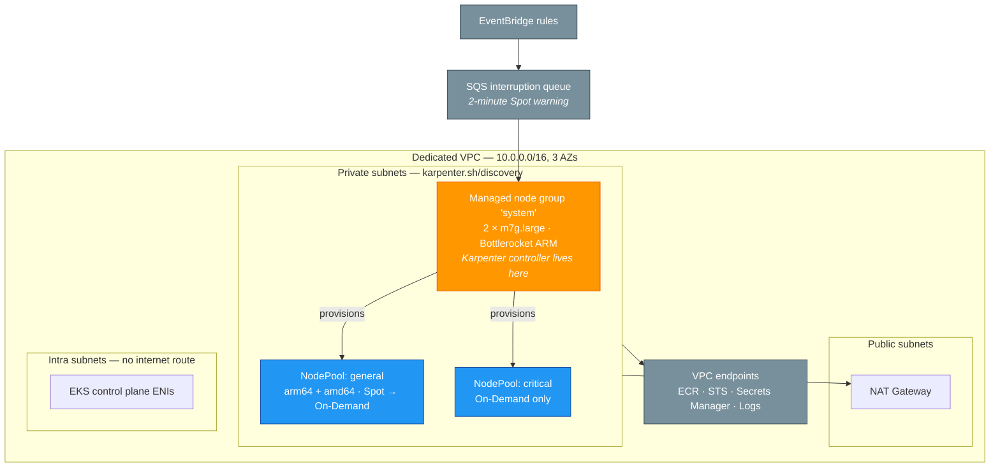

# EKS + Karpenter on multi-architecture Spot capacity

Terraform that stands up a production-shaped Amazon EKS cluster in a dedicated
VPC, with [Karpenter](https://karpenter.sh) provisioning nodes on **both
Graviton (arm64) and x86 (amd64)**, preferring Spot and falling back to
On-Demand.

A developer schedules a pod on the architecture they want with a single line of
YAML. There is no node group to create, no capacity to reserve, and no ticket
to raise.

---

## What gets built



| Component | Choice | Why |
|---|---|---|
| Kubernetes | EKS `1.36` | Latest available; configurable via `kubernetes_version` |
| Node OS | Bottlerocket | Read-only root, no shell, atomic updates — smaller attack surface than a general-purpose AMI |
| System capacity | 2 × `m7g.large` On-Demand | Karpenter cannot provision the node it runs on; this is the stable floor |
| Workload capacity | Karpenter, Spot-first | Cheapest instance that fits, chosen per pod |
| Architectures | arm64 **and** amd64 | One NodePool serves both |
| Controller identity | **EKS Pod Identity** | Current mechanism; no OIDC trust policy to maintain |
| Spot safety | SQS interruption queue | Nodes drain gracefully on the 2-minute warning |

---

## Prerequisites

| Tool | Version |
|---|---|
| Terraform | ≥ 1.5.7 |
| AWS CLI | v2, configured with credentials |
| kubectl | ≥ 1.30 |
| Helm | ≥ 3.0 *(only if you want to inspect the local chart)* |

The IAM principal running Terraform needs permission to create VPC, EKS, IAM,
EC2, SQS and EventBridge resources.

---

## Quick start

```bash
cd terraform

terraform init
terraform plan -out=tfplan     # read it
terraform apply tfplan
```

Roughly 15 minutes, most of it the EKS control plane. Then:

```bash
aws eks update-kubeconfig --region eu-west-1 --name demo-eks-karpenter

kubectl get nodes
kubectl get nodepools,ec2nodeclasses
```

To change anything, override the defaults:

```bash
cp terraform.tfvars.example terraform.tfvars
# edit, then apply
```

| Variable | Default | Notes |
|---|---|---|
| `name` | `demo-eks-karpenter` | Prefix for every resource |
| `region` | `eu-west-1` | |
| `kubernetes_version` | `1.36` | |
| `vpc_cidr` | `10.0.0.0/16` | |
| `az_count` | `3` | |
| `single_nat_gateway` | `true` | Set `false` for production HA |
| `node_cpu_limit` | `100` | Ceiling on vCPUs Karpenter may provision |
| `endpoint_public_access_cidrs` | `0.0.0.0/0` | **Narrow this for anything real** |

---

## Tests

The repository ships a test suite written with Terraform's native
[test framework](https://developer.hashicorp.com/terraform/language/tests).

```bash
terraform test
```

```
tests/karpenter.tftest.hcl... pass
tests/network.tftest.hcl... pass
tests/variables.tftest.hcl... pass

Success! 17 passed, 0 failed.
```

Every test uses `mock_provider`, so the suite **runs offline, needs no AWS
credentials and creates nothing**. That is deliberate: a test suite that costs
money or requires a live account is a test suite that stops being run.

| File | What it protects |
|---|---|
| `tests/variables.tftest.hcl` | Input validation — rejects invalid names, malformed CIDRs, single-AZ deployments; asserts the defaults have not drifted |
| `tests/network.tftest.hcl` | Subnet arithmetic — tier sizing, no overlap between tiers, and that the maths follows `vpc_cidr` instead of assuming `10.0.0.0/16` |
| `tests/karpenter.tftest.hcl` | Node strategy — system node group stays Graviton and small, Karpenter version is an exact pin compatible with K8s 1.36, capacity has a ceiling, and the production posture is reachable by variable |

The addressing tests get the most attention because that failure is silent. An
undersized private tier does not break the apply; it breaks months later when
pods stop receiving IP addresses, and by then the fix is a cluster rebuild.

Run a single file with:

```bash
terraform test -filter=tests/network.tftest.hcl
```

<details>
<summary>Running this in CI</summary>

The repository root is limited to `terraform/` and `architecture/` as the
assignment requires, so no workflow directory is included. This is the job
that would go in one:

```yaml
name: terraform
on: [push, pull_request]

jobs:
  validate:
    runs-on: ubuntu-latest
    defaults:
      run:
        working-directory: terraform
    steps:
      - uses: actions/checkout@v4
      - uses: hashicorp/setup-terraform@v3
        with:
          terraform_version: 1.13.x

      - run: terraform fmt -check -recursive
      - run: terraform init -backend=false
      - run: terraform validate
      - run: terraform test          # no credentials needed - all mocked

      - uses: bridgecrewio/checkov-action@master
        with:
          directory: terraform
          framework: terraform
```

No AWS credentials are required for any step, which means the whole suite can
run on pull requests from forks.

</details>

---

## Running a pod on Graviton or x86

This is the part the cluster exists for. Ready-to-apply manifests are in
[`examples/`](./examples/).

### On Graviton (arm64)

One line does it:

```yaml
spec:
  nodeSelector:
    kubernetes.io/arch: arm64
```

```bash
kubectl apply -f examples/01-graviton-arm64.yaml
kubectl rollout status deploy/hello-graviton
```

Karpenter sees a pod it cannot schedule, works out that it needs arm64,
launches a Graviton instance, and the pod starts — typically in under a minute.
The container prints its own architecture, so you can check rather than assume:

```bash
kubectl logs -l app=hello-graviton --tail=5
```

```
==========================================
 Architecture : aarch64          ← Graviton
 Node         : ip-10-0-40-133.eu-west-1.compute.internal
 Pod          : hello-graviton-7d4c8f9b6-x2mkp
==========================================
```

### On x86 (amd64)

Same manifest, different selector:

```yaml
spec:
  nodeSelector:
    kubernetes.io/arch: amd64
```

```bash
kubectl apply -f examples/02-x86-amd64.yaml
kubectl logs -l app=hello-x86 --tail=5
```

```
 Architecture : x86_64
```

### Better still: say nothing

For a normal stateless service, constraining the architecture is usually the
wrong instinct. Omit the selector and Karpenter picks the cheapest capacity
that fits — in practice Graviton Spot:

```bash
kubectl apply -f examples/03-multiarch-let-karpenter-choose.yaml
```

This requires a multi-architecture image, which is one flag at build time:

```bash
docker buildx build --platform linux/amd64,linux/arm64 \
  -t <account>.dkr.ecr.<region>.amazonaws.com/app:1.0.0 --push .
```

### Forcing On-Demand

For workloads that must not be interrupted:

```yaml
spec:
  nodeSelector:
    karpenter.sh/capacity-type: on-demand
```

```bash
kubectl apply -f examples/04-ondemand-critical.yaml
```

### Seeing what Karpenter did

```bash
kubectl get nodes -L kubernetes.io/arch,karpenter.sh/capacity-type,node.kubernetes.io/instance-type
```

| Selector | Result |
|---|---|
| `kubernetes.io/arch: arm64` | Graviton instance |
| `kubernetes.io/arch: amd64` | x86 instance |
| *(none)* | Cheapest that fits — usually arm64 Spot |
| `karpenter.sh/capacity-type: on-demand` | On-Demand, never reclaimed |

---

## How it works

**Discovery by tag.** Terraform tags the private subnets and the node security
group with `karpenter.sh/discovery = <cluster name>`. The `EC2NodeClass`
selects on that tag rather than on hardcoded IDs, so the VPC can be rebuilt
without touching Karpenter's configuration.

**Two NodePools.**

| | `general` | `critical` |
|---|---|---|
| Architectures | arm64 + amd64 | arm64 + amd64 |
| Capacity | Spot → On-Demand | On-Demand only |
| Consolidation | `WhenEmptyOrUnderutilized` | `WhenEmpty` |
| Weight | 100 | 10 |

Karpenter tries the higher-weighted pool first, so a pod lands on cheap Spot
capacity unless its own constraints rule that out.

**Why Spot is safe here.** Diversification across many instance families and
three AZs means no single capacity pool can take the cluster down; the SQS
interruption queue turns the two-minute AWS warning into a graceful cordon and
drain; PodDisruptionBudgets stop Kubernetes draining below a floor; and
On-Demand stays in the requirements list, so a Spot shortage costs money rather
than availability.

**Disruption budgets.** Karpenter will not voluntarily disrupt more than 10 % of
nodes at once, and does nothing voluntary at all between 09:00 and 18:00 on
weekdays. Involuntary Spot reclamation is unaffected — this governs Karpenter's
own consolidation decisions, not AWS's.

**Node expiry.** Nodes are replaced after 14 days. On an immutable OS like
Bottlerocket, replacement *is* the patching strategy.

---

## Cost

Steady state with no workloads, `eu-west-1`:

| Item | ~Monthly |
|---|---|
| EKS control plane | $73 |
| System node group (2 × m7g.large) | $120 |
| NAT gateway (single) | $32 |
| VPC endpoints (6 interface) | $43 |
| **Baseline** | **~$268** |

Karpenter capacity is on top and scales to zero when nothing is scheduled.
Graviton Spot in this region runs roughly **$0.012/vCPU-hour**, about 75 % below
x86 On-Demand.

For a POC, `single_nat_gateway = true` and dropping the interface endpoints
takes the baseline under $210. Neither is appropriate for production, which is
why both are variables rather than edits.

---

## Teardown

```bash
# Remove workloads first so Karpenter releases its nodes
kubectl delete -f examples/ --ignore-not-found

# Wait until only the system node group remains
kubectl get nodes -w

terraform destroy
```

Deleting Karpenter-managed nodes before `terraform destroy` matters: Terraform
does not know about instances Karpenter created, and orphaned nodes will block
VPC deletion.

---

## Layout

```
terraform/
├── versions.tf          provider and Terraform constraints
├── providers.tf         AWS + Helm (v3 syntax)
├── variables.tf         inputs, with validation
├── main.tf              VPC, VPC endpoints, EKS cluster
├── karpenter.tf         Karpenter IAM/SQS, controller, NodePools
├── outputs.tf
├── charts/
│   └── karpenter-nodepools/   EC2NodeClass + both NodePools
└── examples/
    ├── 01-graviton-arm64.yaml
    ├── 02-x86-amd64.yaml
    ├── 03-multiarch-let-karpenter-choose.yaml
    └── 04-ondemand-critical.yaml
```

---

## Notes on the choices

**Why a managed node group at all?** Karpenter is a pod; it cannot provision the
node it runs on. Cluster-critical components also should not sit on capacity
that Karpenter may consolidate away or that Spot may reclaim. Two small
On-Demand instances remove an entire class of outage for a predictable cost.

**Why Bottlerocket?** No shell and no package manager means a much smaller
attack surface, and updates are atomic image swaps rather than in-place package
upgrades. The `bottlerocket@latest` alias resolves per architecture, so one
`EC2NodeClass` serves Graviton and x86 alike.

**Why Pod Identity instead of IRSA?** IRSA requires an OIDC provider and a trust
policy per role. Pod Identity is a direct association between a service account
and a role, with no cluster-specific IAM plumbing to maintain.

**Why is the NodePool a Helm chart?** `kubernetes_manifest` resolves CRD schemas
at *plan* time, so it cannot manage a CRD that will not exist until *apply*.
Shipping the manifests as a small local chart means the entire stack — cluster,
controller and NodePools — comes up in one `terraform apply`.

**What would change for production.** Remote state with locking (the backend
block is present but commented), `single_nat_gateway = false`,
`endpoint_public_access_cidrs` narrowed to known ranges, an external secrets
operator, and a policy engine such as Kyverno enforcing Pod Security Standards
and image provenance.
